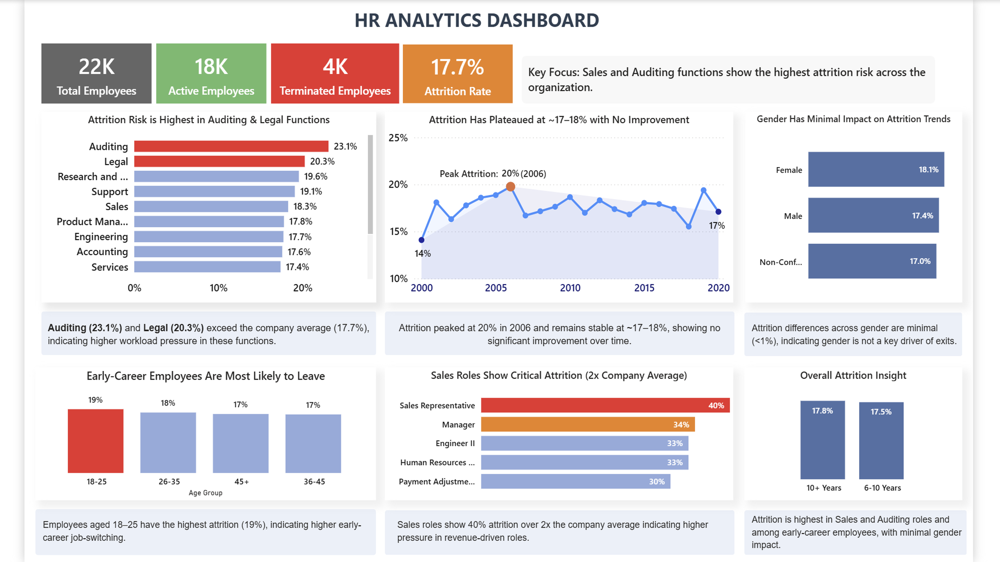

# HR Attrition Analysis Dashboard

## 📌 Overview
This project analyzes employee attrition using SQL for data analysis and Power BI for visualization to identify key drivers of employee exits.

---

## 📊 Key Metrics
- Total Employees: 22,000  
- Active Employees: 18,000  
- Terminated Employees: 4,000  
- Attrition Rate: 17.7%  

---

## 🔍 Key Insights
- Auditing (23.1%) and Legal (20.3%) exceed the company average (17.7%)
- Attrition remains stable at ~17–18% with no improvement over time
- Sales roles show 40% attrition (2x company average)
- Employees aged 18–25 have highest attrition (19%)
- Gender impact is minimal (<1%)

---

## 📷 Dashboard Preview

---

## 🛠 Tools Used
- SQL (Data analysis and querying)
- Power BI (Data visualization)

---

## 📂 SQL Analysis
Key SQL queries used:
- Employee tenure calculation using date functions
- Attrition rate calculation by department
- Employee distribution by department, job role, and location
- Hiring vs termination trend over time
- Demographic analysis (age, gender, race)

---

## 🎯 Conclusion
Attrition is highest in high-pressure roles and early-career employees, with minimal gender impact.
