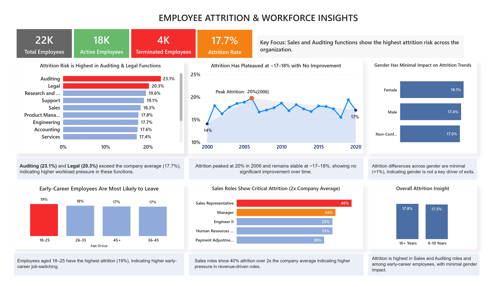

# Employee Attrition Analysis & Workforce Insights

## 📌 Problem Statement
Employee attrition impacts organizational stability, productivity, and cost. This project analyzes HR data to identify attrition patterns, high-risk segments, and key drivers of employee turnover.

---

## 📊 Dataset
- 22K+ employee records  
- Features include department, job role, salary, tenure, and attrition status  

---

## 🔍 Key Analysis
- Performed data cleaning and transformation using SQL and Excel  
- Conducted exploratory data analysis to identify workforce trends  
- Built an interactive Power BI dashboard for visualization and insights  

---

## 📈 Key Insights
- Sales (40%) and Auditing (23%) show the highest attrition rates  
- Early-career employees exhibit higher turnover trends  
- Attrition varies significantly across departments and tenure levels  

---

## 💡 Business Impact
- Enabled data-driven decision-making for HR teams  
- Highlighted high-risk departments for targeted retention strategies  
- Improved visibility into workforce patterns and attrition drivers  

---

## 🛠️ Tools & Technologies
- SQL  
- Power BI  
- Microsoft Excel  

---

## 📷 Dashboard Preview

---

## 🚀 Conclusion
This project demonstrates how data analysis and visualization can help organizations proactively address attrition and improve workforce retention strategies.
